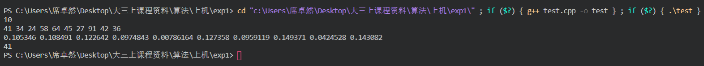

# 实验一实验报告-分治与递归
### 计算机84 席卓然 2186113559
## 一、问题描述
设有n个互不相同的元素$x_1,x_2,...,x_n$，每个元素$x_i$带有一个权值$w_i$，且$\sum_{i=1}^nw_i=1\leq\frac{1}{2}$，则称元素$x_k$为$x_1,x_2,...,x_n$的带权中位数。请编写一个算法，能够在最坏的情况下用$O(n)$时间找出n个元素的带权中位数。
## 二、问题分析
对于寻找带权中位数的问题，其实是一个不断对原数组进行划分+比较的过程，可以利用分治法的思想，首先利用一个Select函数对原数组产生一个划分，在划分左侧计算一个sumweightleft，在划分右侧计算一个sumweightright，这样通过比较左右的权值与0.5的关系，判断划分处是否为带权中位数以及正确的带权中位数应该在左侧或是右侧，以此不断递归地进行寻找，直到找到该带权中位数
## 三、算法设计
在该算法中，设计用结构体变量node表示一个元素，它具有的属性是价值value和权值weight;其次，需要函数对数组进行划分Partition，在划分产生前需要利用Selection对划分点进行生成，这里的Selection函数是决定最坏时间复杂度的关键，最初的设想是直接采用rand()产生一个随机的划分点，但是这样的随机算法的平均时间复杂度是$O(n)$，最坏时间复杂度是$O(n^2)$；为了使最坏时间复杂度达到要求，最终采用的是2个Selection函数，第一步插入排序产生中位数，第二部再对中位数进行插入排序，优化了复杂度需求。
## 四、算法实现
```c++
#include <iostream>
using namespace std;

struct node
{
    int value;
    double weight;
};
void Print(node *A, int len)
{
    int i;
    for(i = 1; i <= len; i++)
        cout<<A[i].value<<' ';
    cout<<endl;
    for(i = 1; i <= len; i++)
        cout<<A[i].weight<<' ';
    cout<<endl;
}

int Partition(node *A, int p, int r)
{
    int i = p-1, j;
    for(j = p; j < r; j++)
    {
        if(A[j].value <= A[r].value)
        {
            i++;
            swap(A[i], A[j]);
        }
    }
    swap(A[i+1], A[r]);
    return i+1;
}
node Select(node *A, int p, int r, int i);
//对每一组从start到end进行插入排序，并返回中值
//插入排序
node Insert(node *A, int start, int end, int k)
{
    int i, j;
    for(i = 2; i <= end; i++)
    {
        node t = A[i];
        for(j = i; j >= start; j--)
        {
            if(j == start)
                A[j] = t;
            else if(A[j-1].value > t.value)
                A[j] = A[j-1];
            else
            {
                A[j] = t;
                break;
            }
        }
    }
    return A[start+k-1];
}
//根据文中的算法，找到中值的中值
node Find(node *A, int p, int r)
{
    int i, j = 0;
    int start, end, len = r - p + 1;
    node *B = new node[len/5+1];
    //每5个元素一组，长度为start到end，对每一组进行插入排序，并返回中值
    for(i = 1; i <= len; i++)
    {
        if(i % 5 == 1)
            start = i+p-1;
        if(i % 5 == 0 || i == len)
        {
            j++;
            end = i+p-1;
            //对每一组从start到end进行插入排序，并返回中值,如果是最后一组，组中元素个数可能少于5
            node ret = Insert(A, start, end, (end-start)/2+1);
            //把每一组的中值挑出来形成一个新的数组
            B[j] = ret;    
        }
    }
    //对这个数组以递归调用Select()的方式寻找中值
    node ret = Select(B, 1, j, (j+1)/2);
    //delete []B;
    return ret;
}
//以f为主元的划分
int Partition2(node *A, int p, int r, node f)
{
    int i;
    //找到f的位置并让它与A[r]交换
    for(i = p; i < r; i++)
    {
        if(A[i].value == f.value)
        {
            swap(A[i], A[r]);
            break;
        }
    }
    return Partition(A, p, r);
}
//寻找数组A[p..r]中的第i大的元素，i是从1开始计数，不是从p开始
node Select(node *A, int p, int r, int i)
{
    //如果数组中只有一个元素，则直接返回
    if(p == r)
        return A[p];
    //根据文中的算法，找到中值的中值
    node f = Find(A, p, r);
    //以这个中值为主元的划分，返回中值在整个数组A[1..len]的位置
    //因为主元是数组中的某个元素，划分好是这样的，A[p..q-1] <= f < A[q+1..r]
    int q = Partition2(A, p, r, f);
    //转换为中值在在数组A[p..r]中的位置
    int k = q - p + 1;
    //与所寻找的元素相比较
    if(i == k)
        return A[q];
    else if(i < k)
        return Select(A, p, q-1, i);
    else
        //如果主元是数组中的某个元素，后面一半要这样写
        return Select(A, q+1, r, i-k);
        //但是如果主元不是数组中的个某个元素，后面一半要改成Select(A, q, r, i-k+1)
}
//寻找数组A[p..r]中的第i大的元素，i是从1开始计数，不是从p开始
node Select2(node *A, int p, int r, double i)
{
    //如果数组中只有一个元素，则直接返回
    if(p == r)
        return A[p];
    //根据文中的算法，找到中值的中值
    node f = Find(A, p, r);
    //以这个中值为主元的划分，返回中值在整个数组A[1..len]的位置
    //因为主元是数组中的某个元素，划分好是这样的，A[p..q-1] <= f < A[q+1..r]
    int q = Partition2(A, p, r, f);
    //转换为中值在在数组A[p..r]中的位置
    int k = q - p + 1;
    //与所寻找的元素相比较
    double w = 0;
    for(int j = p; j <= k; j++)
        w += A[j].weight;
    if(w-A[k].weight < i && w >= i)
        return A[q];
    else if(w-A[k].weight >= i)
        return Select2(A, p, q-1, i);
    else
        //如果主元是数组中的某个元素，后面一半要这样写
        return Select2(A, q+1, r, i-w);
        //但是如果主元不是数组中的个某个元素，后面一半要改成Select(A, q, r, i-k+1)
}
int main()
{
    int n, sum = 0, i;
    cin>>n;
    node *A = new node[n+1];
    int *B = new int[n+1];
    //生成随机数据
    for(i = 1; i <= n; i++)
    {
        A[i].value = rand() % 100;
        do{B[i] = rand() % 100;}while(B[i]==0);
        sum = sum + B[i];
    }
    //将权值规格化
    for(i = 1; i <= n; i++)
        A[i].weight = (double)B[i]/sum;
    //打印生成的数据
    Print(A, n);
    //求带权中位数
    cout<<Select2(A, 1, n, 0.5).value<<endl;
    return 0;
}
```
## 五、运行结果
该算法在输入数组长度n后，会随机产生一组合理数据并运行结果，如下图输入10后的输出结果：  

输出了带权中位数41，经演算符合带权中位数的定义，程序运行正确。