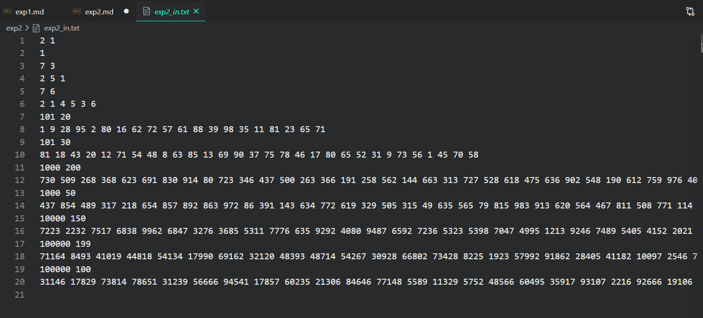
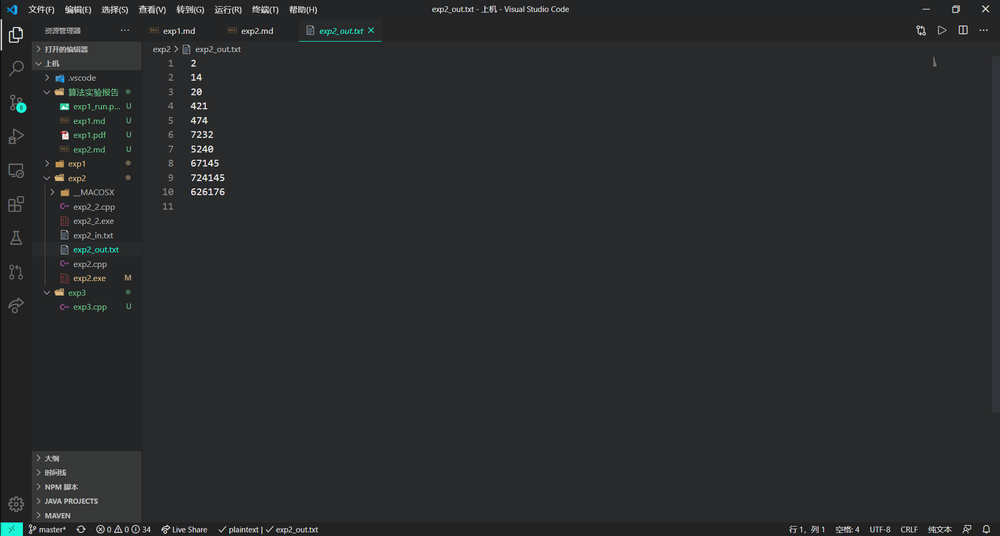

# 实验二实验报告-动态规划
### 计算机84 席卓然 2186113559
## 一、问题描述
设有一个长度为L的钢条，在钢条上标有n个位置点$(p_1,p_2,...p_n)$。现在需要按钢条上标注的位置将钢条切割为n+1段，假定每次切割所需要的代价与所切割的钢条长度成正比。请编写一个算法，能够确定一个切割方案，使切割的总代价最小。
## 二、问题分析
本题是一道典型的区间动态规划问题，思路为将切割钢条问题逆序思考，转换为将每一段小钢条按顺序拼接为长度为L的钢条的问题，用一个dp二维数组对已经求得的子结构数据进行保存，dp[i][j]=sum(sticks[i]..sticks[j])+min(dp[i][k]+dp[k+1][j])其中k从i到j-1,表示从第i段拼接到第j段的最小代价。这样在建立了dp数组之后，dp[0][m-1]就表示了拼接长度为L的最小代价。
## 三、算法设计
在本算法中，sticks数组保存第i段的钢条长度，sum数组保存从0到i段钢条的长度之和,dp数组保存从第i段拼接到第j段的最小代价，count表示迭代过程中的区间长度。因为这是一道区间dp问题，我们可以从count=1迭代到count=m-1，把所有的区间长度迭代一遍，维护dp矩阵的右上三角区域即可  
另外还在算法中设计了backtrace函数，它可以递归地返回每一次切割的位置，达到返回一个最优切割方案的目的。
## 四、算法实现
```c++
//设有一个长度为L的钢条，在钢条上标有n个位置点（p1,p2,…,pn）。
//现在需要按钢条上标注的位置将钢条切割为n+1段，假定每次切割所需要的代价与所切割的钢条长度成正比。
//请编写一个算法，能够确定一个切割方案，使切割的总代价最小。
//1.最优子结构
//2.递归关系
//3.计算最优值
//4.构造最优解
//将切钢条过程反过来，求由短条合并为长条需要的代价

//每根钢条的长度sticks
//然后dp[i][j]表示sticks[i]..sticks[j]合并需要的最小代价
//dp[i][j]=sum(sticks[i]..sticks[j])+min(dp[i][k]+dp[k+1][j])其中k从i到j-1
#include<iostream>
#include<vector>
#include<stdio.h>
#include<algorithm>
using namespace std;

int minCost(vector<int>& sticks,vector<int>& res,vector<vector<int> >& dp,vector<int>& sum) {
    int m = sticks.size();
    // dp[i][j]表示sticks[i..j]合并需要的最小代价
    for (int i = 0; i < m; i++) {
      dp[i][i] = 0;
      sum[i + 1] = sum[i] + sticks[i];//sum保存着所有可能的短条组合的长度
    }
    for (int count = 1; count <= m; ++count) {//第一层循环，count记录着从i到j的区间的长度
      for (int i = 0; i + count < m; ++i) {
        int j = i + count;
        for (int k = i; k < j; ++k) {//遍历k在i到j区间内的所有可能，求出最小的dp[i][k]+dp[k+1][j]
          //if(dp[i][j]>dp[i][k]+dp[k+1][j])res.push_back(k);
          dp[i][j] = min(dp[i][j], dp[i][k] + dp[k + 1][j]);
          //min(dp[i][k]+dp[k+1][j])
        }
        dp[i][j] += sum[j + 1] - sum[i];
      }
    }
    /*for(int k=0;k<m-1;k++){
      //cout<<sum[m]<<endl;
      //if(dp[0][m - 1] == dp[0][1]+dp[2][m-1]+sum[m]){cout<<"yes";}
      int temp;
      if(dp[0][m - 1] == dp[0][k]+dp[k+1][m-1]+sum[m]){res.push_back(k);}
    }
    /*for(int i=0;i<dp[0].size();i++){
      for(int j=0;j<dp.size();j++){
        cout<<dp[i][j]<<endl;
      }
    }*/
    return dp[0][m - 1];
  }
void backtrace(vector<vector<int> >& dp,vector<int>& sticks,vector<int>& res, int i,int j){
    int m = sticks.size();int sumlength=0;
    int flag=i;
    //cout<<dp[2][3]+dp[4][4];
    // dp[i][j]表示sticks[i..j]合并需要的最小代价//cout<<k<<endl;
    /*for(int i=0;i<dp[0].size();i++){
      for(int j=0;j<dp.size();j++){
        cout<<dp[i][j]<<endl;
      }
    }*/
    //if(j<=i)return;
    //cout<<i<<j;
    int temp;int k;
    //res.push_back(0);
    if(j<i)return;
    if(j==i){
      res.push_back(i);return;
    }
    if(j-i==1){
      res.push_back(i);return;
    }
    for(;i<=j;i++){
      sumlength+=sticks[i];
    }
    i=flag;//重制标志位
    //cout<<sumlength;//sumlength=7;
    for(k=i;k<j;k++){
      //cout<<"hello";
      temp=dp[i][k]+dp[k+1][j]+sumlength;//cout<<temp<<dp[i][j];
      if(dp[i][j] == temp){
        res.push_back(k);break;
        }
    }
    sumlength=0;temp=0;flag=0;//标志位重制
    backtrace(dp,sticks,res,i,k);
    backtrace(dp,sticks,res,k+1,j);
    return;
}


int main(){
    int L;
    freopen("exp2_in.txt","r",stdin);freopen("exp2_out.txt","w",stdout);
    while(cin>>L){
      int num;vector<int> sticks;vector<int> res;int n;
      cin>>n;int m=n+1;vector<int> input(m+1,0);int i;
      //cout<<"input the sticks:0->end"<<endl;
      for(i=1;i<m;i++){
        cin>>input[i];
      }
      input[i]=L;
      sort(input.begin(),input.end());
      /*for(int i=0;i<input.size();i++){
        cout<<input[i]<<endl;
      }*/
      for(int j=0;j<m;j++){
        sticks.push_back(input[j+1]-input[j]);
      }
      /*for(int i=0;i<sticks.size();i++){
        cout<<sticks[i]<<endl;
      }*/
      vector<vector<int> > dp(m, vector<int>(m, numeric_limits<int>::max()));vector<int> sum(m + 1, 0);
      cout<<minCost(sticks,res,dp,sum)<<endl;
    }
    //cout<<dp[2][3]<<dp[4][4]<<dp[2][4];
    //backtrace(dp,sticks,res,0,m-1);
    
    /*for(int i=0;i<dp[0].size();i++){
      for(int j=0;j<dp.size();j++){
        cout<<dp[i][j]<<endl;
      }
    }*/
   /* cout<<"res: "<<res.size()<<endl;
    for(int i=0;i<res.size();i++){
        cout<<res[i]<<endl;
    }*/
    //fclose(stdin);
    //fclose(stdout);
    fclose(stdin);
    fclose(stdout);
    return 0;
}
```
## 五、运行结果
本次算法的验证采用的是输入输出文件的形式，输入文件exp2_in.txt,输出文件exp2_out.txt,样例测试如下：

输出：  
