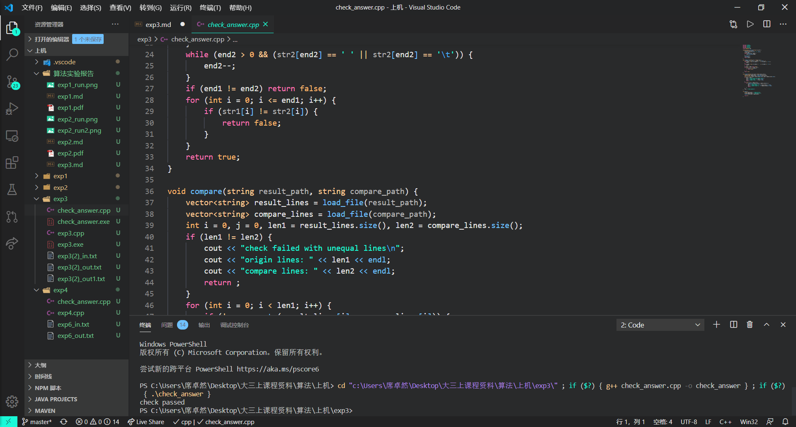

# 实验三实验报告-贪心算法
### 计算机84 席卓然 2186113559
## 一、问题描述
设计一个求解凸包问题的贪心算法，并测试算法正确性。  
注：凸包问题给定平面上n个点，从中找出一个最小点集，使得该点集所组成的凸多边形包围所有的n个点。
## 二、问题分析
为了让所有的点被外圈所包含，需要建立点和直线的关系，并且判断点与线的左右关系，这里选择使用向量积来对其进行判断，$S(P1,P2,P3)=|y1 y2 y3|= (x1-x3)*(y2-y3)-(y1-y3)*(x2-x3)$ 当P1P2P3逆时针时S为正的，当P1P2P3顺时针时S为负的。这样依次进行判断和选择即可。
## 三、算法设计
对于一个凸包问题，最基础的算法是对于每一个点进行n-1次判断，选择最优的点使得包含所有点，但是复杂度过高。如果使用贪心算法对于每个待选择的点进行判断，可以很好的优化算法的复杂度，我们首先通过一个partition函数对于所有的点进行逆时针或顺时针的排序，选定一个初始点；即y坐标最小的点开始进行选择，再利用一个solution函数进行待选择点的判断：满足条件即将其选择；反之则弹出该点，对于下一个点进行判断。
## 四、算法实现
```c++
//设计一个求解凸包问题的贪心算法，并测试算法正确性。
//注：凸包问题给定平面上n个点，从中找出一个最小点集，使得该点集所组成的凸多边形包围所有的n个点。


//对于平面上的所有点，基本按照逆时针顺序对点进行标号，从某一端点出发，优先选择标号最近的点
//建立两者连线，判断下一个标号的点相对于该直线的位置，在右侧说明没有包含，左侧说明包含
//右侧：弹出该点，将在右侧的点入栈，建立该点和出发点的连线。

//思路：point_x,point_y数组保存输入的n个点的位置数据，算法需要返回的点集用res表示，res中保存着最优解的点的序号（序号从0开始计数）

#include<iostream>
#include<vector>
#include<algorithm>
using namespace std;
struct point
{
    int x;int y;double k;
    int order;
    /* data */
};

bool compare(point a,point b){
    if(a.k!=b.k)return a.k<b.k;
    else return a.y<b.y;
}

vector<point> partition(vector<point>& p,vector<point>& q,int n){
    point node;int flag=0;int num=0;
    node.x=500;node.y=500;
    for(int i=0;i<n;i++){
        //node=p[i+1];
        if(p[i].y <node.y||(p[i].x<node.x&&p[i].y == node.y)){
            node=p[i];
            flag=i;
        }//node->minimum y of p.y;
        //if(p[i].y==p[i+1].y)node=p[i].x<p[i+1].x?p[i]:p[i+1];//如果y相同，取横坐标最小
    }
    q.push_back(node);//q[0]是纵坐标最小的点，即p[flag]
    for(int i=0;i<n;i++){
        if(p[i].x-p[flag].x==0&&p[i].y-p[flag].y==0){
            p[i].k=-0.00001;continue;
        }
        if(p[i].x-p[flag].x==0){
            p[i].k=999;continue;
        }
        p[i].k=double(p[i].y-p[flag].y)/double(p[i].x-p[flag].x);
    }
    sort(p.begin(),p.end(),compare);
    /*for(int i=0;i<n;i++){
        cout<<p[i].y<<" ";
    }
    cout<<endl;*/
    for(int i=0;i<n;i++){
        if(p[i].k==-0.00001){num=i;break;}
    }
    for(int i=num+1;i<n;i++){
        q.push_back(p[i]);
    }
    for(int i=0;i<num;i++){
        q.push_back(p[i]);
    }
    return q;
    //此时q按照逆时针顺序保存了所有的点
}

int product(point a,point b,point c){
    return (a.x-c.x)*(b.y-c.y)-(a.y-c.y)*(b.x-c.x);
}
//S(P1,P2,P3)=|y1 y2 y3|= (x1-x3)*(y2-y3)-(y1-y3)*(x2-x3) 

//当P1P2P3逆时针时S为正的，当P1P2P3顺时针时S为负的。

void solution(vector<point>& q,vector<point>& res){
    res.push_back(q[0]);res.push_back(q[1]);res.push_back(q[2]);
    if(q.size()<2){
        return ;
    }
    int temp=2;
    for(int i=3;i<q.size();i++){
        while(product(res[temp-1],res[temp],q[i])<=0){
            res.pop_back();
            if(temp==0)break;
            temp--;
        }
        temp++;
        res.push_back(q[i]);
    }
    return;
}

int main(){
    int n;
    freopen("exp3(2)_in.txt","r",stdin);
    freopen("exp3(2)_out.txt","w",stdout);
    //cout<<"input the n:"<<endl;
    while(cin>>n){
        point input;
        vector<point> p,q;vector<point> res;
        for(int i=0;i<n;i++){
            cin>>input.x;
            cin>>input.y;
            input.order=i;
            p.push_back(input);
        }
        q=partition(p,q,n);//cout<<"q_size1:"<<q.size();
        /*for(int i=0;i<q.size();i++){
            cout<<q[i].x<<"\t";
        }
        cout<<endl;
        for(int i=0;i<q.size();i++){
            cout<<q[i].y<<"\t";
        }*/
        solution(q,res);//cout<<"res:"<<endl;
        /*for(int i=0;i<res.size();i++){
            cout<<res[i].x<<"\t";
        }
        cout<<endl;
        for(int i=0;i<res.size();i++){
            cout<<res[i].y<<"\t";
        }*/
        for(int i=0;i<res.size();i++){
            cout<<res[i].order<<" ";
        }
        cout<<endl;
    }
    fclose(stdin);
    fclose(stdout);
    return 0;
}
```
## 五、运行结果
在输入了测试用例exp3(2)_in.txt文件后，输出了exp3(2)_out.txt，调用check_answer.cpp后的运行截图如下：

可以看到输出了check passed，说明输出结果是正确的。