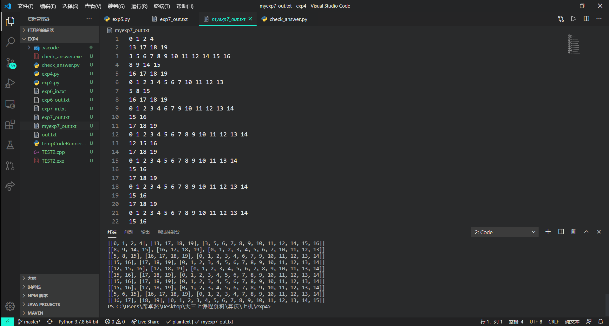

# 实验五实验报告-选做题
### 计算机84 席卓然 2186113559
## 一、问题描述
给定1个1000行×20列的0-1矩阵，对于该矩阵的任意1列，其中值为1的元素的数量不超过10%。设有两个非空集合A和B，每个集合由矩阵的若干列组成。集合A和B互斥是指对于矩阵的任意一行，同时满足下列2个条件：  
1）若A中有一个或多个元素在这一行上的值是1，则B中的元素在这一行全部是0；  
2）若B中有一个或多个元素在这一行上的值是1，则A中的元素在这一行全部是0。请你设计一个算法，找出集合A、B和C，满足：  
1）A、B、C两两互斥，且  
2）A、B和C包含的列的总数最大。
## 二、问题分析
本问题是对实验四-回溯与分支限界法的问题的一个拓展，增加了一个集合C，这样，问题的解空间树从原来的三叉解空间树转换为了四叉树，即对于每一个结点：  
- 该列加入A集合
- 该列加入B集合
- 该列加入C集合
- 该列不加入
同样按照回溯递归的方法对该问题进行求解
## 三、算法设计
同样类似实验四地，定义用到的数据：self.A/self.B/self.C记录当前放入A/B/C中的列的序号；self.res_A/self.res_B/self.res_C记录最优解的A/B/C的列序号；set_A/set_B/set_C保存当前A/B/C中已经有1的行的位置；由于题目要求对于最优解的策略要求，需要A/B/C的长度，A B长度的差的绝对值+B C长度差的绝对值，以及一个记录最优的A,B,C长度和的bestlen。因为需要使用递归回溯的方法进行求解，因此使用一个递归地backtrack函数进行主方法的求解。如果当前最优值小于sum(A_len+B_len+C_len)，进行最优值得修改，相等时则通过给定的4种择优策略进行判断是否需要进行修改。回溯后得到结果。
## 四、算法实现
```python


import sys
class Solution():
    def main(self,List):
        self.A = [] #A保存当前A中放入的列数
        self.B = []
        self.C = []
        self.res_A = [] #res_A保存最优解的A
        self.res_B = []
        self.res_C = []
        self.set_A = set() #set_A保存当前A中已经有1的行
        self.set_B = set()
        self.set_C = set()
        self.A_len = 0
        self.B_len = 0
        self.C_len = 0
        self.absAB = 20
        self.cmp1 = 1000
        self.sum_A = 1000 #解A的和
        self.sum_B = 1000
        self.bestlen = 0 #最优解对应的长度
        self.dic = {}
        self.row = len(List)
        self.column = len(List[0])
        for i in range(self.column):
            self.dic[i] = set()
            for j in range(self.row):
                if List[j][i] == 1:
                    self.dic[i].add(j)
                    # dic[i]保存了第i列有1的所有位置
        # if self.judge():
        self.backtrack(0)
        return [self.res_A,self.res_B,self.res_C]

    def copy(self,set1): #集合的复制
        set2 = set()
        for i in set1:
            set2.add(i)
        return set2

    def intersection(self,set1,set2): #求集合的交集
        set3 = set()
        for i in set1:
            set3.add(i)
        for j in set2:
            set3.add(j)
        return set3

    def compare(self,set1,set2): # set1与set2没有重复元素 true;反之false;
        for i in set1:
            if i in set2:
                return False
        return True

    def sub(self,set1,set2): # 集合减法
        set3 = set()
        for i in set1:
            if i not in set2:
                set3.add(i)
        return set3

    # def judge(self):
    #     for i in range(self.column):
    #         for j in range(i+1,self.column):
    #             for k in range(j+1,self.column):
    #                 if self.compare(self.dic[i],self.dic[j],self.dic[k]):
    #                     return True
    #     return False

    def backtrack(self,i):
        if i>=20:
            if len(self.A)==0 or len(self.B)==0 or len(self.C)==0:
                return
            if(len(self.A)+len(self.B)+len(self.C)>self.bestlen):
                self.res_A = self.A.copy()
                self.res_B = self.B.copy()
                self.res_C = self.C.copy()
                self.A_len = len(self.res_A)
                self.B_len = len(self.res_B)
                self.C_len = len(self.res_C)
                self.absAB = abs(self.A_len-self.B_len)
                self.cmp1 = abs(self.absAB+self.B_len-self.C_len)
                self.bestlen = self.A_len+self.B_len+self.C_len
                sum = 0
                for every in self.res_A:
                    sum += every
                self.sum_A = sum
                sum = 0
                for every in self.res_B:
                    sum += every
                self.sum_B = sum
                # 3个取最优的策略
            elif(len(self.A)+len(self.B)+len(self.C)==self.bestlen):
                if(abs(len(self.A)-len(self.B))+abs(len(self.B)-len(self.C))<self.cmp1):
                    self.res_A = self.A.copy()
                    self.res_B = self.B.copy()
                    self.res_C = self.C.copy()
                    self.A_len = len(self.res_A)
                    self.B_len = len(self.res_B)
                    self.C_len = len(self.res_C)
                    self.absAB = abs(self.A_len - self.B_len)
                    self.cmp1 = self.absAB + abs(len(self.B)-len(self.C))
                    sum = 0
                    for every in self.res_A:
                        sum += every
                    self.sum_A = sum
                    sum = 0
                    for every in self.res_B:
                        sum += every
                    self.sum_B = sum
                elif(abs(len(self.A)-len(self.B))+abs(len(self.B)-len(self.C))==self.cmp1):
                    #if(len(self.A)>self.A_len):
                    sum = 0
                    for every in self.A:
                        sum += every
                    flag = self.sum_A
                    if(sum<self.sum_A):
                        self.res_A = self.A.copy()
                        self.res_B = self.B.copy()
                        self.res_C = self.C.copy()
                        self.A_len = len(self.res_A)
                        self.B_len = len(self.res_B)
                        self.C_len = len(self.res_C)
                        # self.cmp1 = abs(len(self.res_A)-len(self.res_B))+abs(len(self.res_B)-len(self.res_C))
                        self.sum_A = sum
                    elif(sum==flag):
                        sum1 = 0
                        for every in self.B:
                            sum1 += every
                        if(sum1<self.sum_B):
                            self.res_A = self.A.copy()
                            self.res_B = self.B.copy()
                            self.res_C = self.C.copy()
                            self.A_len = len(self.res_A)
                            self.B_len = len(self.res_B)
                            self.C_len = len(self.res_C)
                            self.sum_B = sum1;
                        return
                    return
                return
            return

        # 剪枝条件
        if len(self.A)+len(self.B)+len(self.C)+self.column-i<self.bestlen:
            return
        # 开始递归
        if self.compare(self.sub(self.dic[i],self.set_A),self.set_B) & self.compare(self.sub(self.dic[i],self.set_A),self.set_C):
            temp1 = self.copy(self.set_A)
            self.A.append(i)
            self.set_A = self.copy(self.intersection(self.set_A,self.dic[i]))
            self.backtrack(i+1)
            self.set_A = self.copy(temp1)
            self.A = self.A[0:-1]
            # 放入A集合
        if self.compare(self.sub(self.dic[i],self.set_B),self.set_A) & self.compare(self.sub(self.dic[i],self.set_B),self.set_C):
            temp2 = self.copy(self.set_B)
            self.B.append(i)
            self.set_B = self.copy(self.intersection(self.set_B,self.dic[i]))
            self.backtrack(i+1)
            self.set_B = self.copy(temp2)
            self.B = self.B[0:-1]
            #放入B集合
        if self.compare(self.sub(self.dic[i],self.set_C),self.set_A) & self.compare(self.sub(self.dic[i],self.set_C),self.set_B):
            temp3 = self.copy(self.set_C)
            self.C.append(i)
            self.set_C = self.copy(self.intersection(self.set_C,self.dic[i]))
            self.backtrack(i+1)
            self.set_C = self.copy(temp3)
            self.C = self.C[0:-1]
            #放入C集合
        self.backtrack(i+1) #不放入该列
def read():
    infile = open("exp7_in.txt","r")
    outfile = open("myexp7_out.txt", "w")
    s = infile.read()
    index = 0
    n = 0
    while True:
        if s[index]=='\n':
            index+=1
            break
        else:
            n = n*10+int(s[index])
            index+=1
    for _ in range(n):
        L = []
        for i in range(1000):
            List = []
            while True:
                if s[index] == '\n':
                    index += 1
                    L.append(List)
                    break
                if s[index] != ' ':
                    List.append(int(s[index]))
                index += 1
        S = Solution()
        ans = S.main(L)
        print(ans)
        outfile.write(' '.join(str(num)for num in ans[0])+'\n')
        outfile.write(' '.join(str(num)for num in ans[1])+'\n')
        outfile.write(' '.join(str(num)for num in ans[2])+'\n')
    infile.close()
    outfile.close()
read()
```
## 五、运行结果
程序运行后输出到文件"myexp7_out.txt"，截图如下：

输出文件如下：
```
0 1 2 4
13 17 18 19
3 5 6 7 8 9 10 11 12 14 15 16
8 9 14 15
16 17 18 19
0 1 2 3 4 5 6 7 10 11 12 13
5 8 15
16 17 18 19
0 1 2 3 4 6 7 9 10 11 12 13 14
15 16
17 18 19
0 1 2 3 4 5 6 7 8 9 10 11 12 13 14
12 15 16
17 18 19
0 1 2 3 4 5 6 7 8 9 10 11 13 14
15 16
17 18 19
0 1 2 3 4 5 6 7 8 9 10 11 12 13 14
15 16
17 18 19
0 1 2 3 4 5 6 7 8 9 10 11 12 13 14
15 16
17 18 19
0 1 2 3 4 5 6 7 8 9 10 11 12 13 14
5 6 15
16 17 18 19
0 1 2 3 4 7 8 9 10 11 12 13 14
16 17
18 19
0 1 2 3 4 5 6 7 8 9 10 11 12 13 14 15
```